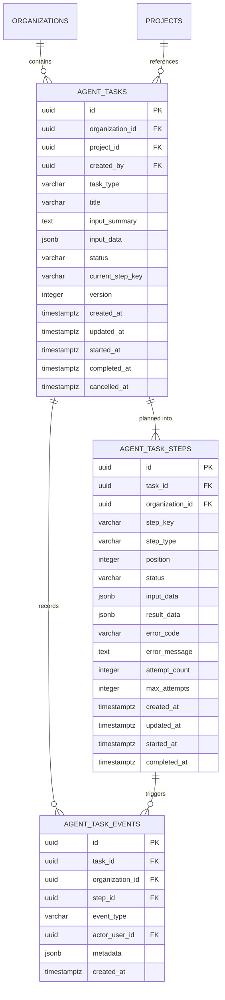
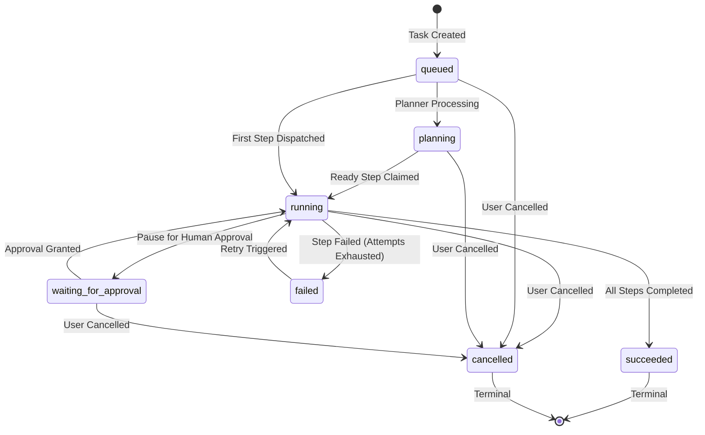
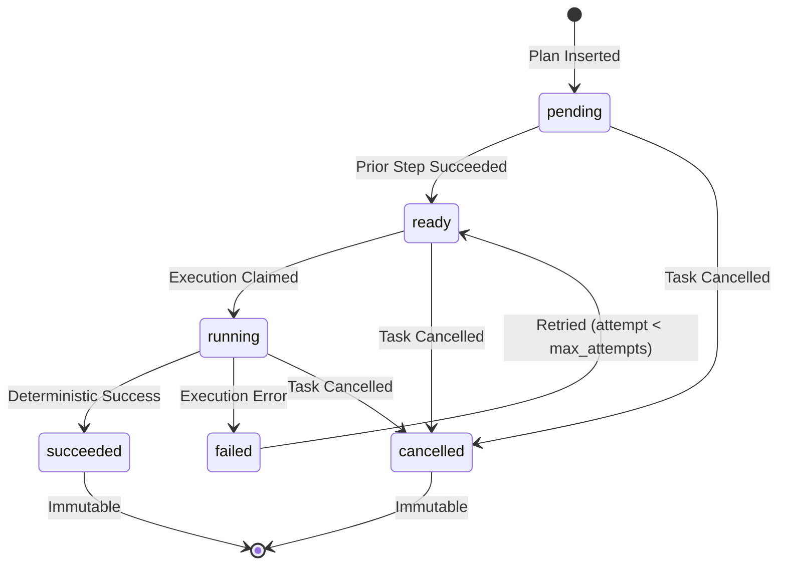

# ModuCraft Phase 4A — AI Agent Orchestrator Architecture

## 1. Overview & Architectural Goals

ModuCraft Phase 4A establishes the core backend foundation for orchestrating AI agent workflows. It provides a robust, tenant-isolated state machine and execution engine for long-running and multi-step tasks without exposing arbitrary code execution or premature LLM dependencies.

### Core Design Tenets
1. **Strict Tenant Isolation under Forced PostgreSQL RLS:** Every task, step, and event is strictly bounded to an authorized organization.
2. **Immutability & Least Privilege:** The application runtime database role (`moducraft_runtime`) has restrictive column-level write grants; primary keys, tenant IDs, input data, and audit records are structurally immutable.
3. **Deterministic & Concurrency-Safe:** All transitions adhere to formal state machine rules. Step execution and state transitions use transactional row locking (`SELECT ... FOR UPDATE`) and optimistic concurrency versioning.
4. **Local & Safe Execution Policy:** In Phase 4A, execution is purely deterministic and local. Shell commands, arbitrary filesystem writes, dynamic code evaluation, and external network/provider calls are strictly prohibited.
5. **Atomic Audit Logging:** All task lifecycle milestones (creation, completion, failure, retry, cancellation) are atomically recorded in PostgreSQL audit logs via the secure `moducraft_record_audit_event()` function.

---

## 2. Database Schema & Data Model

The orchestrator data model is defined in migration `db/migrations/0005_agent_orchestrator.sql`:



### Key Schema Constraints
- **Composite Unique Keys for Tenant Consistency:**
  - `agent_tasks(organization_id, id)`: Ensures parent task tenant ID is authoritative.
  - Foreign keys in `agent_task_steps` and `agent_task_events` reference `(organization_id, task_id)` on `agent_tasks`, guaranteeing child steps and events cannot be orphaned or attached to foreign organizations.
- **Ordered Step Uniqueness:**
  - `UNIQUE (task_id, step_key)`: Prevents duplicate step keys within a workflow.
  - `UNIQUE (task_id, position)`: Enforces strict sequential ordering of planned steps.
- **Append-Only Event Ledger:**
  - `agent_task_events` has no `UPDATE` or `DELETE` grants for `moducraft_runtime`. All lifecycle events are permanent audit trails.

---

## 3. PostgreSQL Security & Privilege Matrix

| Table | SELECT | INSERT | UPDATE | DELETE |
| :--- | :---: | :---: | :---: | :---: |
| `agent_tasks` | Full | `(organization_id, project_id, created_by, task_type, title, input_summary, input_data, status, current_step_key, version)` | `(status, current_step_key, version, started_at, completed_at, cancelled_at)` | Prohibited |
| `agent_task_steps` | Full | `(task_id, organization_id, step_key, step_type, position, status, input_data, result_data, attempt_count, max_attempts)` | `(status, result_data, error_code, error_message, attempt_count, started_at, completed_at)` | Prohibited |
| `agent_task_events` | Full | `(task_id, organization_id, step_id, event_type, actor_user_id, metadata)` | Prohibited | Prohibited |

### Forced RLS Policies
All three tables enforce `FORCE ROW LEVEL SECURITY`:
- **SELECT Policies:** Evaluated via `moducraft_is_org_member(organization_id)`. Any tenant data outside the authenticated user's organization is completely invisible (returning HTTP `404 Not Found`).
- **INSERT/UPDATE Policies:** Evaluated via `moducraft_has_org_role(organization_id, ARRAY['owner', 'admin', 'member'])`. Viewers are rejected at the database level if API authorization checks were somehow bypassed.

---

## 4. State Machine Architecture

### Task State Machine


### Step State Machine


---

## 5. Concurrency & Concurrency Control Semantics

To prevent double execution, lost updates, or race conditions during multi-instance execution:
1. **Row-Level Locking (`FOR UPDATE`):**
   ```sql
   SELECT * FROM agent_tasks WHERE id = $1 FOR UPDATE;
   SELECT * FROM agent_task_steps WHERE task_id = $1 ORDER BY position ASC FOR UPDATE;
   ```
   Locks are held for the duration of the step evaluation within the transaction.
2. **Optimistic Version Bumping:**
   Every update to `agent_tasks` increments the `version` integer:
   ```sql
   UPDATE agent_tasks SET status = 'running', version = version + 1 WHERE id = $1;
   ```
3. **Strict Transition Validation:**
   The `OrchestratorStateMachine` rejects invalid transitions (e.g. attempting to run a cancelled or failed task without retry) before applying mutations.

---

## 6. Deterministic Task Planner

The `DeterministicTaskPlanner` maps human or API task requests into typed, ordered steps without LLM dependencies:
- **`project_summary`:**
  1. `fetch_project_metadata` (`inspect_project_meta`)
  2. `analyze_architecture` (`generate_architecture_summary`)
  3. `compile_summary_report` (`compile_report`)
- **`repository_review_plan`:**
  1. `scan_dependencies` (`inspect_manifest`)
  2. `analyze_code_structure` (`generate_architecture_summary`)
  3. `evaluate_security_baseline` (`scan_security_surface`)
- **`implementation_plan`:**
  1. `inspect_requirements` (`inspect_project_meta`)
  2. `draft_technical_specification` (`generate_architecture_summary`)
  3. `generate_verification_matrix` (`compile_report`)

---

## 7. Safe Local Placeholder Executor

The `SafePlaceholderExecutor` implements the execution contract purely via safe mock results:
- **No Subprocesses:** No calls to `child_process.exec`, `spawn`, or shell utilities.
- **No File Writes:** Does not touch the host filesystem.
- **No External Outbound HTTP:** Performs zero remote requests.
- **Failure Simulation Support:** Triggered cleanly when `simulateFailure: true` is supplied in `inputData`, producing structured errors with `errorCode = "SIMULATED_STEP_FAILURE"`.
