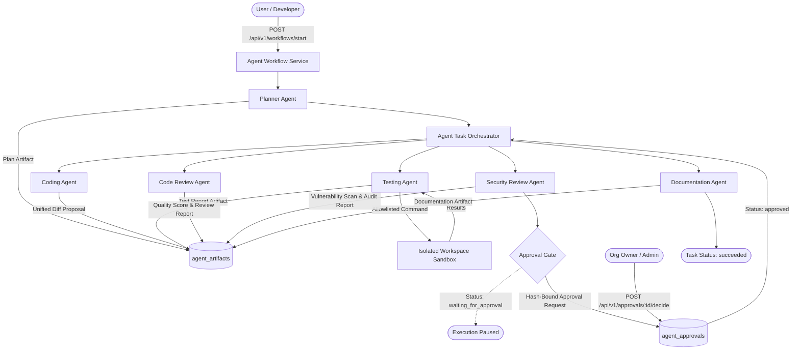

# ModuCraft Phase 4D: Agent Workflow Integration Architecture

## 1. System Overview

Phase 4D unites the previously delivered foundational modules:
- **Phase 2:** Forced PostgreSQL Row-Level Security & Tenant Isolation
- **Phase 3A:** Authenticated API Gateway with Transaction-Scoped Identity Context
- **Phase 3B:** Organization & Project CRUD API with Audit Event Logging
- **Phase 4A:** Deterministic Agent Orchestrator with State Machine and Event Journaling
- **Phase 4B:** AI Provider Abstraction with Model Discovery and SSRF Protection
- **Phase 4C:** Conversational Memory, Scoped Context Assembly, and DLP Redaction

Phase 4D establishes a **controlled, resumable, observable multi-agent workflow** that coordinates specialized agents (`Planner`, `Coding`, `Testing`, `Code Review`, `Security Review`, `Documentation`) without granting them unrestricted host, filesystem, process, network, or database privileges.

---

## 2. Multi-Agent Workflow Pipeline



---

## 3. Core Architectural Components

### 3.1 Typed Agent Contracts
Each agent implements a strict typed contract (`AgentContract<TInput, TOutput>`):
- **Role:** Explicit identifier (`planner`, `coding`, `testing`, `code_review`, `security_review`, `documentation`).
- **Allowed Capabilities:** Least-privilege set of tool capabilities from the tool registry.
- **Context Limits:** Enforced token budget (16k–32k tokens) prevents model context exhaustion.
- **Untrusted Model Inputs:** All outputs from LLMs, files, and tools are treated as untrusted data and validated against Zod schemas before persistence.
- **Fail-Safe Operation:** If a provider is not configured or an error occurs, the agent returns an actionable error; it never fakes execution or fabricates success.

### 3.2 Controlled Tool Gateway
The `ToolGateway` acts as an enforcement boundary between agents and project resources:
1. **`read_workflow_status`**: Queries current task lifecycle state, current step, and retry attempt counters.
2. **`read_project_manifest`**: Reads authorized project manifest (`package.json`) from the workspace sandbox.
3. **`inspect_file`**: Reads an explicitly scoped source file after strict path traversal and containment validation.
4. **`create_patch_proposal`**: Stages an immutable, inspectable unified diff in `agent_artifacts` without directly modifying workspace files.
5. **`run_test_command`**: Runs an allowlisted test command (`test`, `test:unit`, `test:coverage`, `typecheck`, `lint`) inside an isolated workspace runner.
6. **`produce_review_report`**: Generates a structured code or security review report artifact with findings and scores.

#### Security Invariants:
- **No Generic Shell Tool:** Arbitrary command execution, host shell access, Docker socket access, and host process spawning are forbidden.
- **Path Traversal Protection:** Relative traversals (`../`), absolute paths (`/etc/`, `C:\Windows`), drive letters, and null bytes are rejected.
- **Bounded Resource Quotas:** Strict timeouts (5s–30s) and maximum output size limits (64KB–512KB) prevent resource exhaustion attacks.

### 3.3 Artifact Integrity & Storage (`agent_artifacts`)
- **Immutability:** Once written, `content`, `content_hash`, and `size_bytes` cannot be altered. The PostgreSQL runtime role `moducraft_runtime` is denied `UPDATE` privileges on these columns at the SQL grant level.
- **SHA-256 Content Fingerprint:** Every artifact has a cryptographically computed `content_hash`.
- **Review Lifecycle:** Review status transitions between `pending`, `approved`, and `rejected`.

### 3.4 Hash-Bound, Single-Use Approval Gates (`agent_approvals`)
- **Cryptographic Binding:** Approvals are explicitly bound to `(task_id, action, target_content_hash)`.
- **Replay Protection:** An approval can only be decided once (`pending -> approved/rejected`). Any subsequent decision attempt is rejected with `409 Conflict`.
- **Expiration Defense:** Every approval has a strict expiration (`expires_at`, default 24h). Expired approval requests cannot be decided or consumed.
- **Tamper Resistance:** If the underlying artifact content is modified after the approval request was created, the SHA-256 hash mismatch immediately aborts execution.
- **Role Enforcement:** Only users with `owner` or `admin` organization roles are permitted to decide approval requests. Members are rejected by both service validation and forced PostgreSQL RLS.

---

## 4. Database Security Architecture

```text
Table: public.agent_artifacts
+-----------------+--------------------------+-------------------------------------------------+
| Column          | Type                     | Security & Integrity Constraints                |
+-----------------+--------------------------+-------------------------------------------------+
| id              | uuid                     | PRIMARY KEY DEFAULT gen_random_uuid()           |
| organization_id | uuid                     | NOT NULL REFERENCES organizations(id)           |
| project_id      | uuid                     | REFERENCES projects(organization_id, id)        |
| task_id         | uuid                     | NOT NULL REFERENCES agent_tasks(org_id, id)     |
| step_id         | uuid                     | REFERENCES agent_task_steps(org_id, id)         |
| artifact_type   | text                     | CHECK in ('patch_proposal', 'test_report', ...)  |
| title           | text                     | CHECK 1 <= length <= 200                        |
| content         | text                     | CHECK 1 <= length <= 524288 (512 KB)            |
| content_hash    | text                     | CHECK length = 64 (SHA-256 hex)                 |
| size_bytes      | integer                  | CHECK 0 <= size_bytes <= 524288                 |
| review_status   | text                     | CHECK in ('pending', 'approved', 'rejected')    |
| metadata        | jsonb                    | DEFAULT '{}'                                    |
| created_by      | uuid                     | NOT NULL REFERENCES app_users(id)               |
+-----------------+--------------------------+-------------------------------------------------+
Row-Level Security: ENABLED & FORCED
Runtime Grants: SELECT, DELETE, INSERT, UPDATE(review_status, metadata, updated_at)
IMMUTABLE: content, content_hash, size_bytes (NO UPDATE GRANT)
```

```text
Table: public.agent_approvals
+---------------------+--------------------------+---------------------------------------------+
| Column              | Type                     | Security & Integrity Constraints            |
+---------------------+--------------------------+---------------------------------------------+
| id                  | uuid                     | PRIMARY KEY DEFAULT gen_random_uuid()       |
| organization_id     | uuid                     | NOT NULL REFERENCES organizations(id)       |
| task_id             | uuid                     | NOT NULL REFERENCES agent_tasks(org_id, id) |
| step_id             | uuid                     | REFERENCES agent_task_steps(org_id, id)     |
| artifact_id         | uuid                     | REFERENCES agent_artifacts(id)              |
| action              | text                     | CHECK 1 <= length <= 80                     |
| target_content_hash | text                     | CHECK length = 64 (SHA-256 hex)             |
| status              | text                     | CHECK in ('pending','approved','rejected',..)|
| required_role       | text                     | CHECK in ('owner', 'admin')                 |
| expires_at          | timestamp with time zone | NOT NULL                                    |
| approved_by         | uuid                     | REFERENCES app_users(id)                    |
| decided_at          | timestamp with time zone | Set upon decision                           |
| decision_reason     | text                     | CHECK length <= 1000                        |
+---------------------+--------------------------+---------------------------------------------+
Row-Level Security: ENABLED & FORCED
Runtime Grants: SELECT, DELETE, INSERT, UPDATE(status, approved_by, decided_at, decision_reason, metadata, updated_at)
IMMUTABLE: action, target_content_hash (NO UPDATE GRANT)
```
