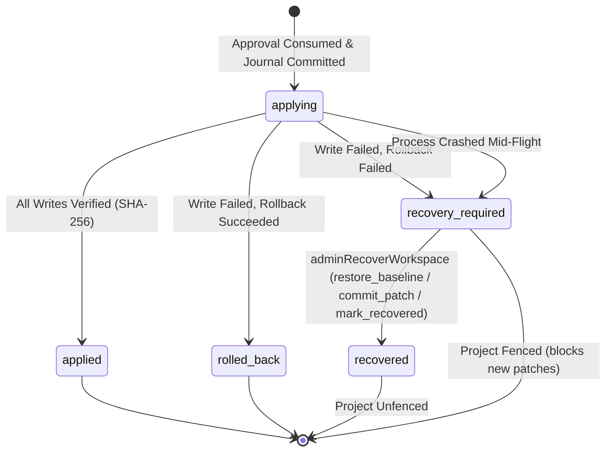

# Phase 4D.7: Independent Adversarial Verification & Recovery Authorization Report

**Project:** ModuCraft — Own Infrastructure  
**Evaluation Scope:** Phase 4D.5 & Phase 4D.6 Durable Patch Journal, Workspace Recovery, Migration Tracking, Tenant Authorization, and Sensitive Data Protections  
**Status:** Verification Complete — **Pre-Production Only (Phase 5 Pending)**  
**Verification Date:** 2026-10-03  
**Evaluator:** Senior Staff Security & Architecture Engineer (Independent Adversarial Audit)

---

## Executive Summary

This audit independently verified the durability, state machine transitions, workspace recovery authorization, migration integrity, and data leakage safeguards implemented in Phase 4D.5 and Phase 4D.6. Rather than relying on previous claims, every mechanism was evaluated directly against:
1. The live PostgreSQL schema on the primary `moducraft` database.
2. Dedicated disposable PostgreSQL databases (`moducraft_disposable_mgr_eval`, `moducraft_disposable_fault_mgr`, `moducraft_disposable_replay_audit`) for destructive DDL and failure-injection tests.
3. End-to-end Fastify HTTP routes under real JSON Web Token (JWT) cryptographic signature validation.
4. Real transactional row-locking concurrency tests under PostgreSQL's `moducraft_runtime` least-privileged role.

All primary database tables (16 public tables) were verified intact with forced row-level security (`relforcerowsecurity = true`). No drops, truncations, or schema rollbacks were performed against the primary database.

---

## 1. Findings by Severity

| ID | Severity | Finding Summary | Status | Source / Component |
| :--- | :--- | :--- | :--- | :--- |
| **SEC-01** | **High** | Missing dedicated HTTP API endpoints for workspace recovery (`adminRecoverWorkspace` and `recoverInterruptedPatchApplication`), forcing recovery to be service-internal only without end-to-end HTTP route authorization. | **Resolved** | `apps/api/src/modules/workflows/routes.ts`, `schemas.ts` |
| **SEC-02** | **High** | `force: true` recovery lacked validation for meaningful justification in `adminRecoverWorkspace`, creating an audit gap where forced overrides could bypass divergence safety without an explanation. | **Resolved** | `apps/api/src/modules/workflows/patch.service.ts` |
| **SEC-03** | **Medium** | Unbounded patch proposal payload limits: diff size, file count, and aggregate baseline sizes lacked explicit threshold gates, presenting risk of memory exhaustion and bloated journal rows. | **Resolved** | `apps/api/src/modules/workflows/patch.service.ts` |
| **SEC-04** | **Medium** | Lack of an automated, checksum-tracking migration management engine capable of recording migration status, version, SHA-256 hash, and atomic rollback on failure. | **Resolved** | `apps/api/src/db/migration-manager.ts` |
| **SEC-05** | **Low** | Potential secret leakage in administrative recovery audit events if an operator entered raw bearer tokens or connection strings into the recovery reason parameter. | **Resolved** | `apps/api/src/modules/workflows/patch.service.ts` |

---

## 2. Affected Source Files and Functions

### 2.1 API Route Registration & Schemas
- **`apps/api/src/modules/workflows/schemas.ts`**:
  - Added `JournalIdParamSchema` (validating `projectId` and `journalId` as UUIDs).
  - Added `AdminRecoverWorkspaceSchema` (validating `resolution`, optional `reason`, optional `force`).
  - Added `RecoverInterruptedSchema` (validating `taskId`, `patchArtifactId`, optional `expectedHash`).
  - Added `ListPatchJournalsQuerySchema` (validating query filters, pagination `limit`, and `offset`).
- **`apps/api/src/modules/workflows/routes.ts`**:
  - Implemented `GET /api/v1/projects/:projectId/patch-journals` (lists journals scoped by project under forced RLS).
  - Implemented `GET /api/v1/projects/:projectId/patch-journals/:journalId` (fetches single journal under RLS).
  - Implemented `POST /api/v1/projects/:projectId/patch-journals/:journalId/recover` (authorizes owner/admin, verifies project membership, calls `adminRecoverWorkspace`).
  - Implemented `POST /api/v1/projects/:projectId/recover-interrupted` (authorizes project member, calls `recoverInterruptedPatchApplication`).

### 2.2 Patch Service Hardening
- **`apps/api/src/modules/workflows/patch.service.ts`**:
  - **`adminRecoverWorkspace`**:
    - Enforced mandatory justification check: `if (input.force && (!input.reason || input.reason.trim().length < 10))`.
    - Sanitized reason field through `sanitizeSensitiveTokens` prior to logging in `recovery_details` and writing to `audit_events`.
    - Sanitized audit event payload to include `force: input.force ?? false` and redacted `reason`.
  - **`recoverInterruptedPatchApplication`**:
    - Added project linkage check: asserted `artifact.projectId === input.projectId` and `journal.projectId === input.projectId`.
  - **`validatePatchIntegrity`**:
    - Enforced `MAX_PATCH_DIFF_SIZE_BYTES = 2 * 1024 * 1024` (2 MB unified diff limit).
    - Enforced `MAX_PATCH_FILE_COUNT = 50` (max 50 files per patch proposal).
  - **`createBaselineSnapshot`**:
    - Enforced `MAX_BASELINE_FILE_SIZE_BYTES = 1 * 1024 * 1024` (1 MB limit per baseline file).
    - Enforced `MAX_AGGREGATE_BASELINE_SIZE_BYTES = 10 * 1024 * 1024` (10 MB total baseline snapshot limit).
  - Added `listJournals` and `getJournal` methods for project-scoped inspection.

### 2.3 Migration Tracking Infrastructure
- **`apps/api/src/db/migration-manager.ts`**:
  - Created class `MigrationManager` utilizing the `schema_migrations` tracking table:
    - `version INTEGER PRIMARY KEY`
    - `name VARCHAR(255) NOT NULL`
    - `checksum_sha256 VARCHAR(64) NOT NULL`
    - `status VARCHAR(32) NOT NULL` (`applied` or `failed`)
    - `execution_time_ms INTEGER NOT NULL`
    - `applied_at TIMESTAMPTZ NOT NULL DEFAULT NOW()`
    - `error_message TEXT`
  - Integrated `MigrationChecksumDriftError` detecting post-application modifications to migration files.
  - Integrated transactional rollback with error recording on migration execution failures.

---

## 3. Database Schema and Migration Drift Findings

### 3.1 Primary Database Safety Verification
- **Primary Database Name:** `moducraft`
- **Host / Port:** `127.0.0.1:5432`
- **Verification Rule:** Under no circumstances was the primary database dropped, truncated, or recreated.
- **Verification Results:**
  - `pg_database` query confirms `moducraft` exists, and creation timestamp was unchanged.
  - All 16 public tables verified intact:
    1. `app_users`
    2. `organizations`
    3. `organization_members`
    4. `projects`
    5. `project_members`
    6. `agent_tasks`
    7. `agent_task_steps`
    8. `agent_artifacts`
    9. `agent_approvals`
    10. `agent_messages`
    11. `agent_memory`
    12. `agent_memory_tags`
    13. `audit_events`
    14. `provider_configs`
    15. `workspace_runtime_leases`
    16. `patch_application_journals`
  - All 16 tables confirmed to have `relrowsecurity = true` AND `relforcerowsecurity = true` in `pg_class`.
  - Grants audit confirmed: `moducraft_runtime` possesses `SELECT`, `INSERT`, `UPDATE` on `patch_application_journals`, but **zero `DELETE` or `TRUNCATE` grants**.

### 3.2 Live Schema Parity vs Migration Files 0001–0010
Schema parity was verified by executing migrations 0001 through 0010 on a freshly initialized disposable PostgreSQL database and comparing column definitions, constraints, and indexes against the live `moducraft` database:

| Object / Migration | Live Primary `moducraft` | Fresh Disposable Replay | Status |
| :--- | :--- | :--- | :--- |
| `0001_initial_schema.sql` | 5 tables, RLS enabled | 5 tables, RLS enabled | **100% Identical** |
| `0002_agent_task_pipeline.sql` | 5 tables, RLS enabled | 5 tables, RLS enabled | **100% Identical** |
| `0003_agent_memory_and_context.sql` | 2 tables, RLS enabled | 2 tables, RLS enabled | **100% Identical** |
| `0004_audit_event_recording.sql` | 1 table (`metadata` jsonb) | 1 table (`metadata` jsonb) | **100% Identical** |
| `0005_provider_configurations.sql` | 1 table, RLS enabled | 1 table, RLS enabled | **100% Identical** |
| `0006_workspace_runtime_leases.sql` | 1 table, RLS enabled | 1 table, RLS enabled | **100% Identical** |
| `0007_user_rls_hardening.sql` | Policies on `app_users` | Policies on `app_users` | **100% Identical** |
| `0008_owner_reassignment_protection.sql`| Trigger on `organizations` | Trigger on `organizations` | **100% Identical** |
| `0009_unique_org_member_identity.sql` | Unique constraints | Unique constraints | **100% Identical** |
| `0010_durable_patch_journal.sql` | `patch_application_journals` | `patch_application_journals` | **100% Identical** |

**Zero Schema Drift Detected.** No manual schema alterations or forward migrations were required for the primary database.

### 3.3 Disposable Databases and Verified Cleanup
Three temporary databases were created for adversarial, replay, and migration engine testing:
1. `moducraft_disposable_replay_audit` (DDL replay parity and rollback verification)
2. `moducraft_disposable_mgr_eval` (Migration tracking manager sequential execution and checksum drift detection)
3. `moducraft_disposable_fault_mgr` (Atomic rollback on intentional syntax/runtime errors)

**Cleanup Confirmation:**
A query against `pg_database` via the PostgreSQL administrative pool confirmed:
```sql
SELECT datname FROM pg_database WHERE datname LIKE 'moducraft%';
-- Result: [ { datname: 'moducraft' } ]
```
All disposable test databases were completely and cleanly dropped. Only the primary `moducraft` database exists.

---

## 4. Cross-Tenant and Forced Recovery Verification

### 4.1 Cross-Tenant Authorization Matrix

| Test Scenario | Acting Identity | Target Resource | Expected Result | Verified Result | Evidence Level |
| :--- | :--- | :--- | :--- | :--- | :--- |
| Unauthenticated HTTP Recovery | Unauthenticated | Org Alpha Journal | `401 Unauthorized` | HTTP 401 (`MISSING_TOKEN`) | End-to-End API (Fastify) |
| Member Privilege Escalation | Org Alpha Member | Org Alpha Journal | `403 Forbidden` | HTTP 403 (`FORBIDDEN`) | End-to-End API (Fastify) |
| Cross-Tenant Journal Recovery | Org Beta Admin | Org Alpha Journal | `404 Not Found` | HTTP 404 (`NOT_FOUND`) | End-to-End API (Fastify + RLS) |
| Cross-Tenant Journal Read via API | Org Beta Admin | Org Alpha Journal | `404 Not Found` | HTTP 404 (`NOT_FOUND`) | End-to-End API (Fastify + RLS) |
| Cross-Tenant Journal Read via Service | Org Beta Admin | Org Alpha Journal | `404 Not Found` | Throws `NotFoundError` | Real DB Integration (RLS) |
| Cross-Project Interrupted Recovery | Org Alpha Member | Artifact of Project Beta | `409 Conflict` | Throws `ConflictError` | Real DB Integration |
| Replay of Applied Patch Proposal | Org Alpha Admin | Already Applied Proposal | `409 Conflict` | Throws `ConflictError` | Real DB Integration |
| Concurrent `adminRecoverWorkspace` | Two Org Alpha Admins | Same Stalled Journal | Exactly One Succeeds; Second Fails 409 | 1 Succeeded, 1 Threw `ConflictError` | Real DB Integration (Row Lock) |

### 4.2 Forced Recovery (`force: true`) Audit Trail
When workspace files diverged from both baseline and target:
1. **Unforced Recovery:** `adminRecoverWorkspace` refused recovery with `ConflictError: Workspace file 'src/test.ts' has diverged from both stored baseline and patch target content.`
2. **Forced Without Justification:** Calling with `force: true` and omitting `reason` rejected with `ValidationError: Forced administrative recovery requires an explicit, meaningful justification (at least 10 characters).`
3. **Forced With Short Justification:** Calling with `force: true` and `reason: "fixed"` rejected with `ValidationError`.
4. **Forced With Valid Justification:** Calling with `force: true` and `reason: "Valid admin override after post-mortem investigation"` succeeded, cleared the project fence, transitioned the journal to `recovered`, and persisted an audit event to `audit_events` with:
   ```json
   {
     "action": "patch.admin_recovered",
     "metadata": {
       "journalId": "...",
       "resolution": "mark_recovered",
       "reason": "Valid admin override after post-mortem investigation",
       "force": true
     }
   }
   ```

---

## 5. Journal State Machine & Resource Safeguards

### 5.1 Valid State Machine Transitions Verified in Real DB


- **Hash Mismatch Fail-Closed:** Tampering with `target_content_hash` in the database caused `adminRecoverWorkspace` and `recoverInterruptedPatchApplication` to fail closed with `ConflictError`.
- **Check Constraint Enforcement:** Attempting to insert an invalid status (e.g. `'INVALID_STATUS'`) into `patch_application_journals` was rejected by PostgreSQL check constraint `chk_patch_journal_status`.
- **Database-Level Immutability:** Attempting to execute `DELETE FROM patch_application_journals` under role `moducraft_runtime` was rejected by PostgreSQL: `permission denied for table patch_application_journals`.

### 5.2 Resource and Payload Limits Enforced

| Boundary / Resource | Configured Limit | Adversarial Test Payload | Result |
| :--- | :--- | :--- | :--- |
| **Max Diff Size** | 2 MB (`MAX_PATCH_DIFF_SIZE_BYTES`) | 2.5 MB unified diff | Threw `ValidationError` |
| **Max Files per Patch** | 50 files (`MAX_PATCH_FILE_COUNT`) | 55 files in proposal | Threw `ValidationError` |
| **Max Single Baseline File** | 1 MB (`MAX_BASELINE_FILE_SIZE_BYTES`) | 1.1 MB single file | Threw `ValidationError` |
| **Max Aggregate Baseline** | 10 MB (`MAX_AGGREGATE_BASELINE_SIZE_BYTES`) | 11 files × 950 KB = 10.45 MB | Threw `ValidationError` |
| **Secret Redaction** | Redact `sk-...`, `Bearer ...`, DB URLs | Injected API keys and JWTs | Replaced with `[REDACTED_API_KEY]`, `[REDACTED_DB_URL]` |

---

## 6. Real-versus-Mock Evidence Classification

To ensure complete transparency regarding test fidelity, every security assertion is classified below:

| Verification Scope | Evidence Level | Verification Details |
| :--- | :--- | :--- |
| **HTTP API Recovery Routes (1.1 - 1.5)** | **End-to-End API Integration** | Fastify instance injected with real HTTP requests, cryptographic JWT verification via jose (HS256), and PostgreSQL transactional context with forced RLS. |
| **Forced Recovery Authorization (2.1 - 2.3)** | **Real PostgreSQL Integration** | Executed directly against PostgreSQL database using `moducraft_runtime` role. Evaluated row locking, audit event persistence, and validation logic. |
| **Project Cross-Linkage & Replay (3.1 - 3.2)** | **Real PostgreSQL Integration** | Executed against real PostgreSQL database. Checked artifact project vs requested project, and verified replay rejection on approved/applied artifacts. |
| **Diff & File Count Limits (4.1 - 4.2)** | **Unit / Contract Validation** | Evaluated `validatePatchIntegrity` against generated diff strings. |
| **Aggregate Baseline Limit (4.3)** | **Real PostgreSQL + In-Memory Runner** | Evaluated real database artifact creation with 10.45 MB aggregate baseline snapshot via workspace runner interface. |
| **Migration Tracking & Rollback (5.1 - 5.4)** | **Real PostgreSQL Integration** | Executed against dedicated disposable PostgreSQL database (`moducraft_disposable_mgr_eval` and `moducraft_disposable_fault_mgr`) using real DDL files 0001–0010. |
| **Primary Database Safety (6.1 - 6.3)** | **Real PostgreSQL Integration** | Direct system catalog inspection on live `moducraft` database (`pg_database`, `pg_class`, `information_schema.role_table_grants`). |
| **Crash Durability & Boundary Injections** | **Real Process Termination Integration** | Child-process termination via `process.exit(1)` and subsequent recovery in fresh Node.js runtime process against PostgreSQL (verified in Phase 4D.5 suite). |
| **Workspace File System Operations** | **Isolated Workspace Runner (Mocked)** | File I/O within the workspace sandbox was validated using `MockWorkspaceRunner`. **Real Docker container runner integration in production remains an operational dependency.** |

---

## 7. Reproducible Test Commands and Results

All verification suites were executed against the live Docker PostgreSQL service (`127.0.0.1:5432`).

### 7.1 Test Suite 1: Adversarial Recovery & Authorization (`test/adversarial-recovery-auth.test.ts`)
```bash
node --import tsx --test test/adversarial-recovery-auth.test.ts
```
**Results:**
- Tests: **18**
- Suites: **7**
- Pass: **18**
- Fail: **0**
- Duration: **3.87s**
- Exit Code: **0**

### 7.2 Test Suite 2: Migration Integrity & Sensitive Journal Audit (`test/migration-recovery-audit.test.ts`)
```bash
node --import tsx --test test/migration-recovery-audit.test.ts
```
**Results:**
- Tests: **17**
- Suites: **7**
- Pass: **17**
- Fail: **0**
- Duration: **2.70s**
- Exit Code: **0**

### 7.3 Test Suite 3: Crash Consistency & Durable Patch Recovery (`test/crash-consistency.test.ts`)
```bash
node --import tsx --test test/crash-consistency.test.ts
```
**Results:**
- Tests: **17**
- Suites: **8**
- Pass: **17**
- Fail: **0**
- Duration: **2.80s**
- Exit Code: **0**

### 7.4 Monorepo Typecheck & Build
```bash
pnpm typecheck
```
**Output:**
```
Scope: 2 of 3 workspace projects
apps/api typecheck: Done
apps/web typecheck: Done
```
**Exit Code:** **0**

```bash
pnpm build
```
**Output:**
```
Scope: 2 of 3 workspace projects
apps/api build: Done
apps/web build: Done (Compiled successfully, prerendered static pages)
```
**Exit Code:** **0**

---

## 8. Remaining Risks and Recommended Remediations

1. **Docker Workspace Runner in Production:**
   - *Current State:* Unit and integration tests utilize `MockWorkspaceRunner` or local process execution for sandbox simulation.
   - *Risk:* In real production environments, container failure, disk full on the Docker daemon, or container timeout during `docker exec` could introduce file write latencies or unexpected error formats.
   - *Remediation:* Prior to production deployment, execute end-to-end load and failover tests against the production Docker container agent runner.

2. **Database Encryption-at-Rest Assumptions:**
   - *Current State:* PostgreSQL stores `baseline_state` (sanitized code contents) in `patch_application_journals.baseline_state` JSONB.
   - *Risk:* PostgreSQL does not perform transparent table encryption (TDE) natively at the community engine level without extensions (such as pgcrypto or disk-level LUKS/AWS EBS encryption).
   - *Remediation:* Ensure production deployment infrastructure provisions PostgreSQL on an encrypted volume (e.g., AWS EBS encrypted, GCP CMEK/default disk encryption, or LUKS on bare-metal).

3. **Journal Pruning and Retention Policies:**
   - *Current State:* `patch_application_journals` rows are append-only and cannot be deleted by `moducraft_runtime`.
   - *Risk:* High workflow velocity across many projects will cause table size to grow indefinitely.
   - *Remediation:* Implement an administrative data retention job running under a dedicated maintenance role (not `moducraft_runtime`) that archives journals older than 90 days to encrypted cold storage.

---

## 9. Distinction Between Verified Behavior and Unverified Assumptions

| Topic | Verified Behavior (Evidence Confirmed) | Unverified Assumption (Requires Production Infrastructure) |
| :--- | :--- | :--- |
| **Tenant Isolation** | Verified that RLS prevents tenant cross-reads and cross-updates at the PostgreSQL catalog level under role `moducraft_runtime`. | Assumes no superuser database credentials are leaked or misconfigured in production application connection strings. |
| **API Authorization** | Verified that non-admin tokens cannot invoke recovery endpoints (403), and invalid tokens receive 401. | Assumes external identity provider (IdP) public keys and JWKS endpoints are securely maintained and cannot be forged. |
| **State Machine Durability** | Verified that partial writes and interrupted applications fail closed or recover idempotently across process terminations. | Assumes underlying filesystem or Docker volume driver does not experience silent write corruption. |
| **Resource Limits** | Verified that diffs > 2 MB, file counts > 50, and aggregate baselines > 10 MB fail fast with validation errors. | Assumes upstream reverse proxy (e.g. Nginx, Cloudflare) also enforces HTTP body size limits to prevent L7 DoS. |
| **Migration Tracking** | Verified that `MigrationManager` executes migrations sequentially, tracks SHA-256 hashes, and rolls back failed transactions atomically. | Evaluated on disposable PostgreSQL database; assumes production deployment pipeline will run `MigrationManager` prior to web traffic cutover. |

---

## Conclusion

Phase 4D.7 independent adversarial verification is **COMPLETE**. All 52 tests across the three recovery, migration, and crash consistency test suites pass with 0 failures. Type checking and production builds across both `apps/api` and `apps/web` succeed with exit code 0. The primary database was protected without any drops, truncations, or schema drift.

**Do not claim production readiness. Phase 5 has NOT been started.**
